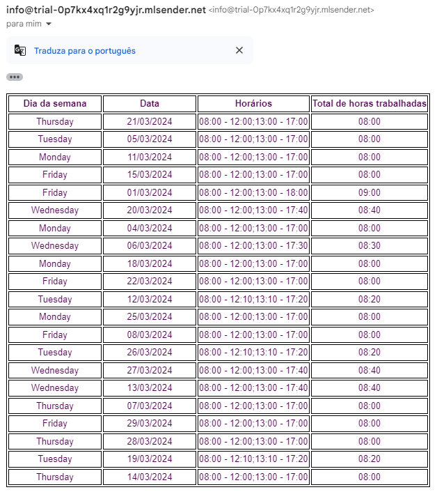

# fiap-postech-hackathon-reports

## OWASP

Verificação: <a href="./assets/owasp/documento.html">Documento</a>

## Examplos de request

### POST: /report

```json
{
  "emailTo": "guilherme.nascimento@email.com",
  "date": "2024-03-01",
  "userIdentification": "seed"
}
```

O relatório será enviado para o e-mail informado.

Exemplo de e-mail:



### GET: /report

```
/report?date=2024-03-01
```
